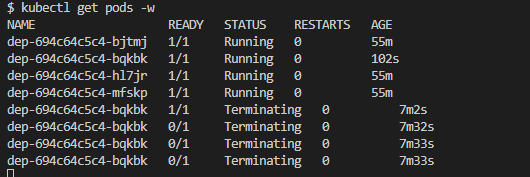
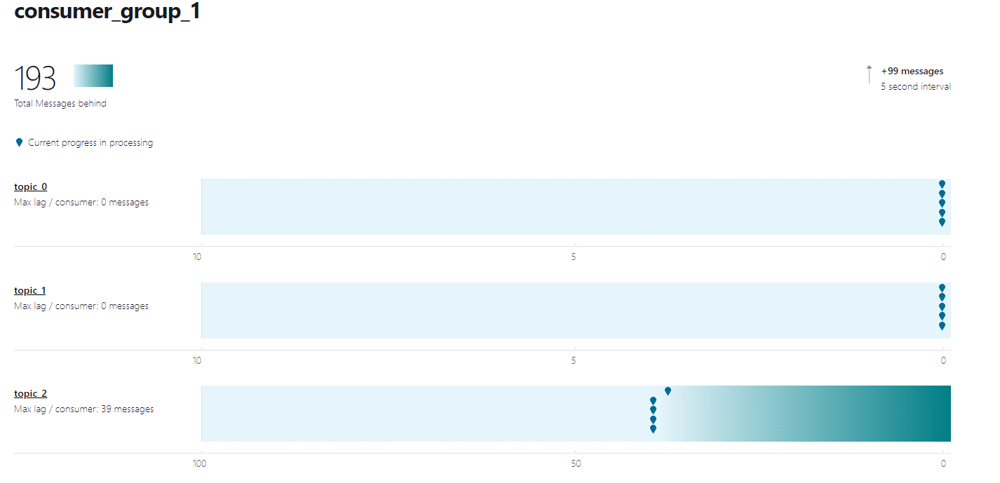
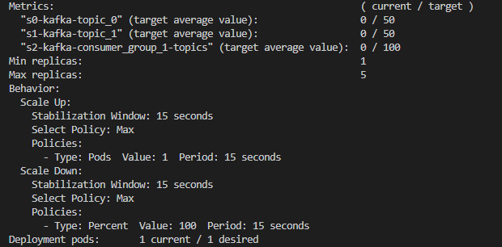

# confluent-keda-poc
### Description
This repo is to:
- Demo Keda connection to confluent
- Demo scaling capabilities of Keda

## Set up
### Kubernetes
Used Minikube
To get endpoint for minikube 
```
minikube service dep --url
```

### Go
```
touch main.go
// Add in basic server codes
go mod init confluent-keda-poc
go mod tidy
```

### Keda
Reference: 
- https://keda.sh/docs/2.7/deploy/
- https://keda.sh/docs/2.8/scalers/apache-kafka/#example
```
helm repo add kedacore https://kedacore.github.io/charts
helm repo update
kubectl create namespace keda
helm install keda kedacore/keda --namespace keda
```

## Observations
### Kafka
1. Spammed produce endpoint 
```
http://127.0.0.1:56825/api/produce
```

2. Confluent Cloud Consumer Lag
- Keda Consumer Lag Setting: `lagThreshold: "50"`
    

3. Scaling up

    
    

4. Scaling down

    

5. Scaling down to below original replicas of 3
- Keda Consumer Config: `minReplicaCount:  1`

    

### Kafka Total Lag
- specified to a scaling target of 100 total consumer lag

1. Total Kafka consumer lag
- Note that Specific topic scaling is not set for `topic_2`. This demo shows that KEDA is triggering based on total Kafka Consumer Lag

    

2. HPA Trigger Scale Up to 2 replicas
- The name of the external metrics also points to the trigger for total Kafka Consumer Lag

    

3. 2 Replicas

    


### CPU
1. Hit 20% Average CPU, Scaling up

    

- cpu scaler need HPAContainerMetrics feature enabled

### Cron
1. Before Cron scaling

    

2. After Cron scaling

    

3. CPU Scaling during Cron scaling period

    

### Custom KEDA Codes to exclude Partitions stuck due to error
#### Custom KEDA Codes
Github Link: https://github.com/JosephABC/keda

Changes are in `kafka_scaler.go` in  [`getLagForPartition`](https://github.com/JosephABC/keda/blob/35354abbc86e9f68f55dfd68d70fd176c5a36300/pkg/scalers/kafka_scaler.go#L408) function

#### Demo
1. Consumer Lag remain the same due to being stuck

    

2. Custom KEDA code excludes Consumer Lag for these partitions, hence 0 consumer lag shown in HPA

    

KEDA does not trigger scaling of consumer deployment based on these stuck partitions


## Issues to think about
### Kafka-scaler
- Message in a partition encounters error and is unable to be consumed and offset cannot be committed.
- Partition Key specified for topic. Large consumer lag observed on one/few particular partitions. Scaling out will probably have less effect on performance
- Metric watched is the total consumer lag for Topic or all topics subcribed by the consumer group

### CPU-Scaler
- `containerName` parameter requires Kubernetes cluster version `1.20 or higher` with `HPAContainerMetrics` feature enabled.

## Others
To Observe and kill process on local
```
netstat -anop | grep -i 5000
pkill <PID>
kill -9 <PID>
```

## To Deploy KEDA to Cluster
```
IMAGE_REGISTRY=docker.io IMAGE_REPO=josephangbc make publish
IMAGE_REGISTRY=docker.io IMAGE_REPO=josephangbc make deploy
```


